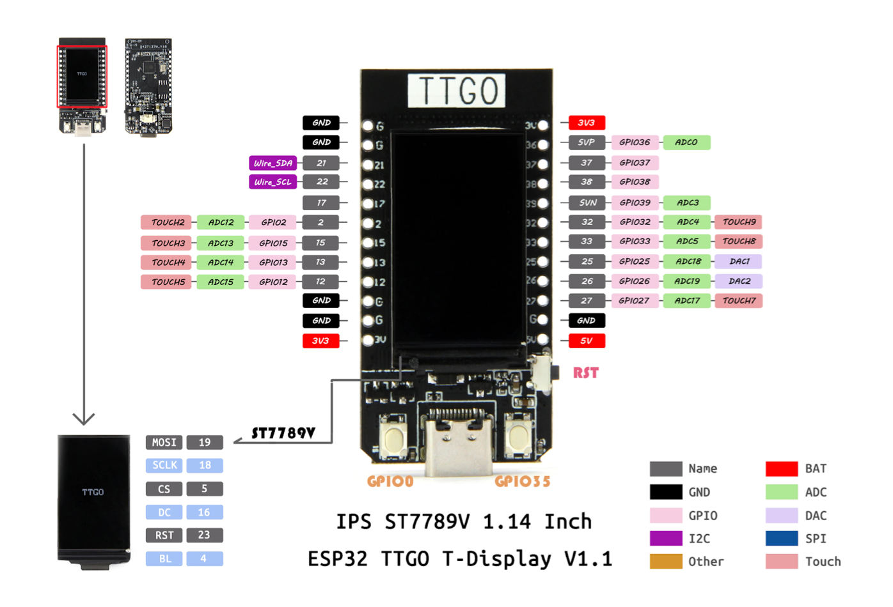

# Creative Embedded System README

## Module 1 - Generative Art 

### Description
The goal of this collaborative project was to create an generative art installation that plays with any text of our choices. The installation was initally intended to have all the ESP32 TTGO T-displays to be hung up in Barnard's CS department, however, due to technical difficulties with our batteries, it ended being on a wired board.

For my specifc code, I took inspiration from our (original) installation date: Valentine's Day &#x1F496;

### Detail

Materials and Softwares required:
- One ESP32 TTGO T-display
- Battery
- USB-C cord
- Arduino

Steps:
1. Download Arduino & set up the ESP32 library (see this link for tutorial)
2. Connect your ESP32 to the laptop using an USB-C cord and try running an example code from the ESP32 Library
3. Code your generative art on Arduino 
4. Repeat step 2 with your code to download it to your ESP32
5. Solder battery to ESP32 so it could run without an USB-C cord

