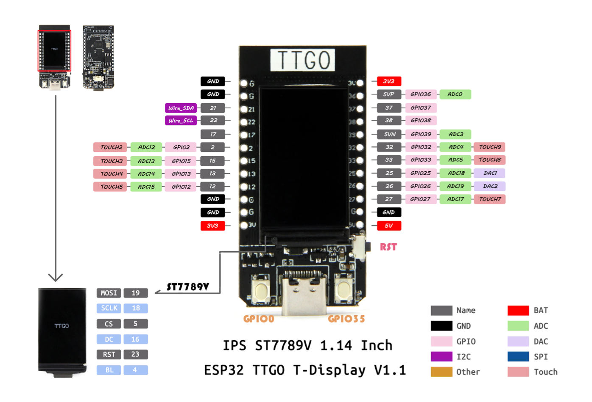

# Creative Embedded System README

## Module 1 - Generative Art 

### Description
The goal of this collaborative project was to create an generative art installation that plays with any text of our choices. The installation was initally intended to have all the ESP32 TTGO T-displays to be hung up in Barnard's CS department, however, due to technical difficulties with our batteries, it ended being on a wired board.

For my specifc code, I took inspiration from our (original) installation date: Valentine's Day &#x1F496;

### Detail

Materials and Softwares required:
- One ESP32 TTGO T-display
- Battery
- USB-C cord
- Arduino

Steps to recreate project:
1. Download Arduino and open the software.

2. Add ESP32 board to Arduino by going <b>Preferences</b> and adding the following link to <b>Additional Board Manager</b>: https://dl.espressif.com/dl/package_esp32_index.json

3. Under <b>Tools > Board > esp32<b>, select <b>TTGO T1</b>

4. Under <b>Tools > Port</b>, make sure your are connected to the port that connects to your ESP32.

5. Install <b>tft_eSPI</b> by <b>Bodmer</b> in Library Manager. 

7. Code your generative art on Arduino, compile and run it on your ESP32. (Make sure the dimension is set for a 160 x 128 screen)

8. (Optional) Solder battery to ESP32 so it could run without an USB-C cord.

Here is a youtube link for the setup demo: https://www.youtube.com/watch?v=adLUgmCJKnM

