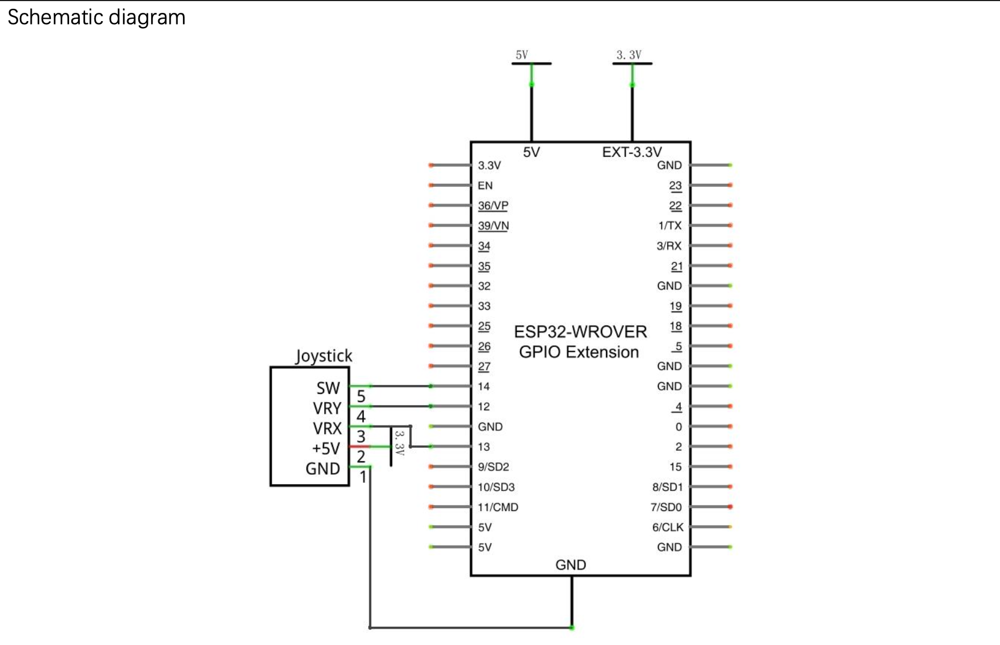
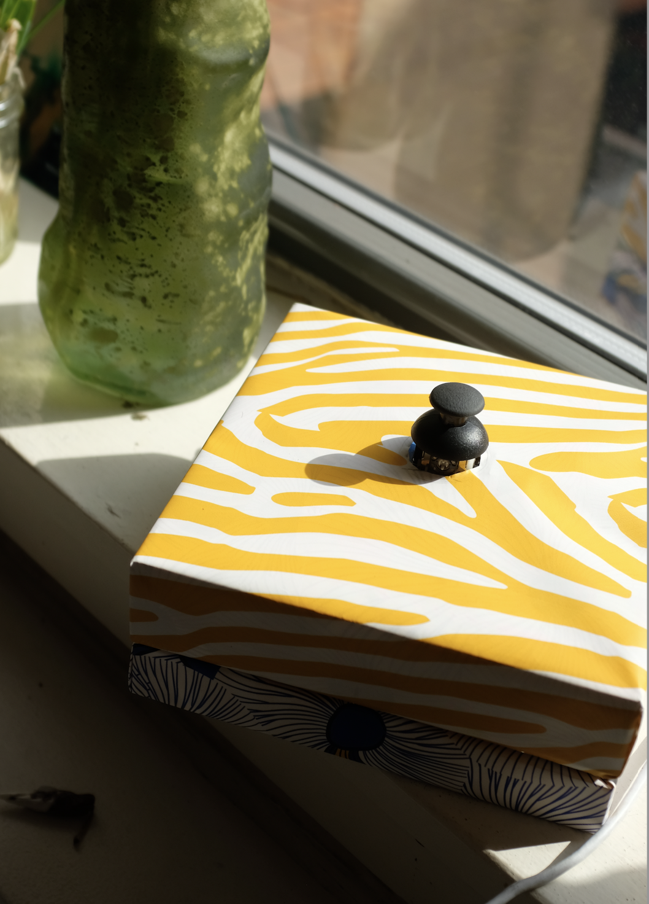
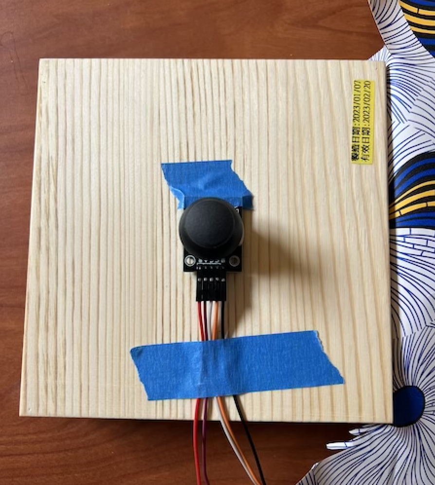
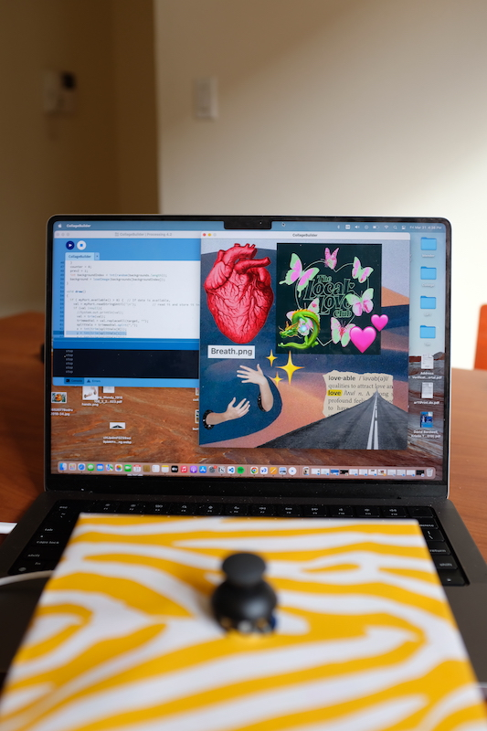
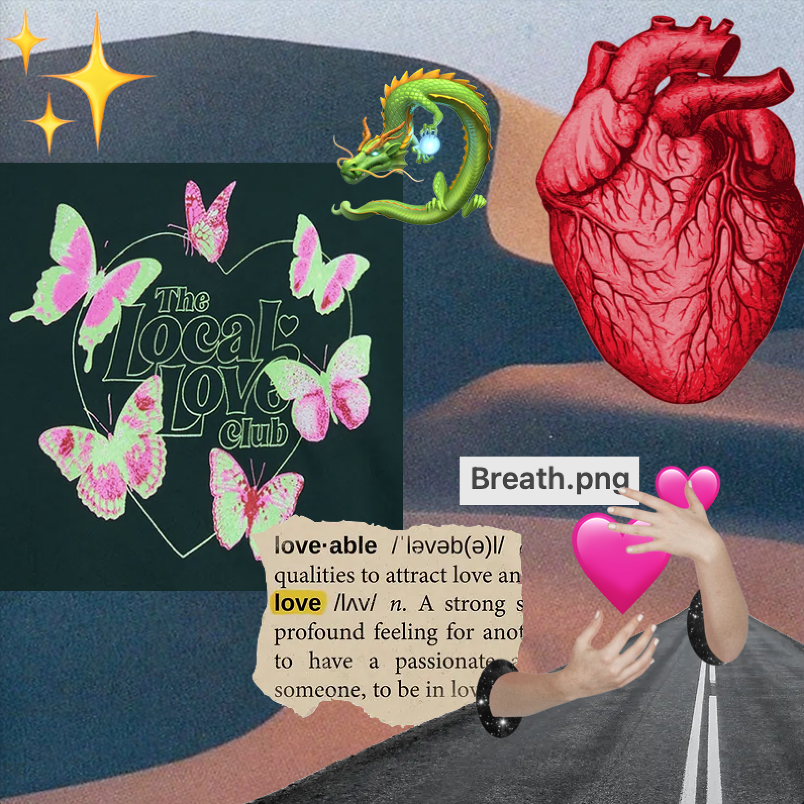

# Module 2 - Interactive Art 

## Project Description
The goal of this project is to create an interactive device that would send data back to my laptop for visualization, sonfication, or any other media generation process. 

### Artistic Vision 

For my specific project, I am creating an interactive device that allows users to create digital collages. Through using a joystick, the user will go through a series of randomly ordered images to build their collage on a background. I was inspired by my childhood passion for making collages and vision boards, which often took days to finish and would always get very messy. With this digital collage builder, one no longer needs to indesisively gather images, painfully cut through them, and be left with sticky fingers upon finishing gluing it all together. 

## Technical Documentation

### Materials and Softwares required:
- One ESP32 TTGO T-display
- Joystick 
- Breadboard
- Button (optional)
- USB-C cord
- wires
- Arduino
- Processing


### Files required: 
```
/module2/joystick.ino        
```
Setting up Serial communication with ESP32 pins
- Opens the serial port at a set baud rate for serial data transmission. 
- Reads X,Y,Z data from the Joystick to Serial Monitor.
- Prints data to the serial port as human-readable ASCII text.

```
/module2/CollageBuilder/CollageBuilder.pde
```
Using the data and turning it into a collage
- Setup: create a canvas, load images and background, and open Serial port for receiving data.
- While data is available, read data and convert it into an image's location coordinates as it hovers.
- Set the location of an image when the Z value changes.
- Iterate through all images to form a collage.


### Setting up the interactive device:  


1. Set up ESP32 and Joystick on a breadboard 
2. Connect ESP32 and Joystick's matching pins using wires according to the schematic below. 
    - SW pin on the Joystick is the Z value for button push. It should change from 1 -> 0 when pushed. 
    - Test on Arduino's serial monitor to see if the values are accurately changing as you toggle the joystick. 
    - If not, it might be an issue with the pins or breadboard. You have to move around and switch pins to find ones that work. 

<div style="display: inline-block;">
        
</div>


### Running the program:  
1. Open module2/joystick.ino in Arduino and run it on ESP32. Make sure the baud rate is set to match the one specified in the code.
2. Open module2/CollageBuilder/CollageBuilder.pde in Processing to start the program. 

### Enclosure Design
<div style="display: inline-block; height=300;">
    
    
</div>

I found a wooden box that would fit the breadboard perfectly if I place it diagonally, which helps stabilize the breadboard.


I knew I wanted to joystick to be outside the box, but have the Joystick pins and wires covered. Wrapping the wrapping paper I got around the Joystick was the hard part. To do this, I measured out the rough size of the joystick circle and cut out a circle for it to fit through. 

Afterward, I taped down the joystick and wires to the lid so that I could stabilize them while I wrap paper over it. 

<div style="display: inline-block; height=500;">
    
      
</div>


## Final Result 

<div style="display: inline-block; height=500;">
    
    
    
</div>

## Blog Post & Video

Blog Post: https://wendysung.github.io/creative-embedded-system/module2/module2.html

Youtube: https://youtu.be/xbElPfbKn1U

