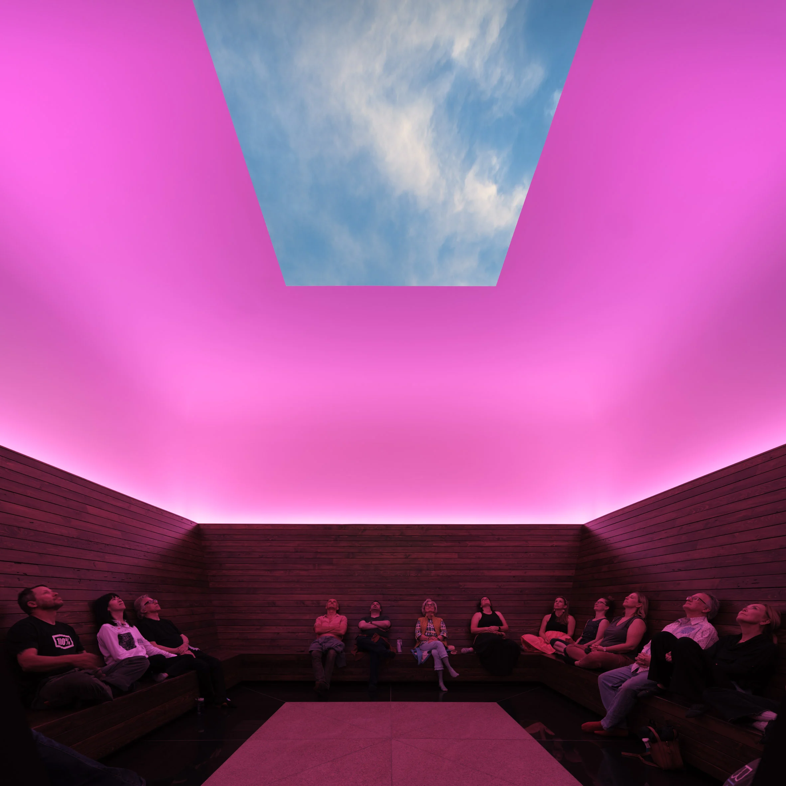
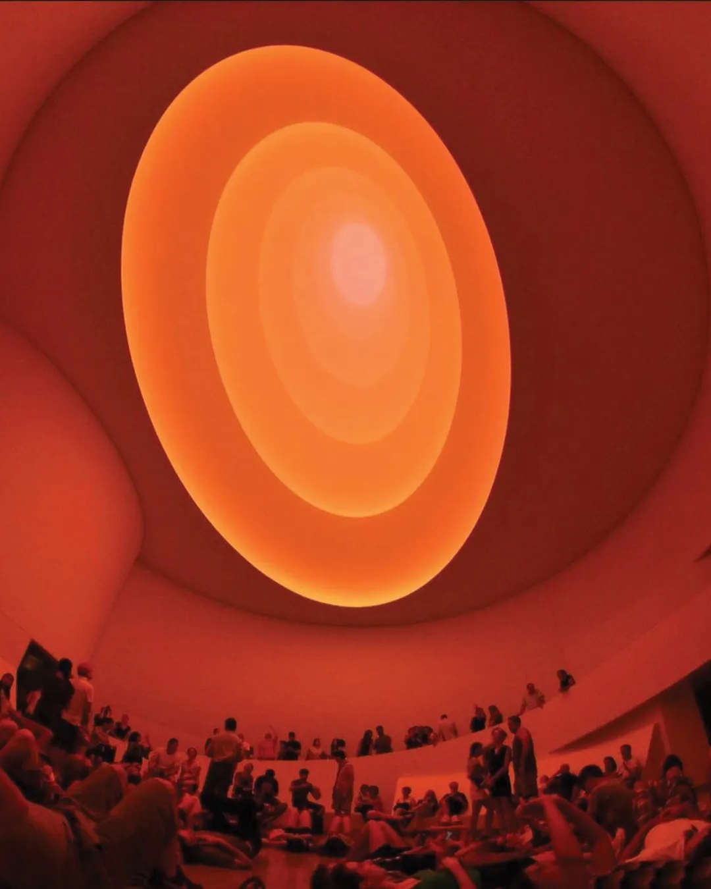
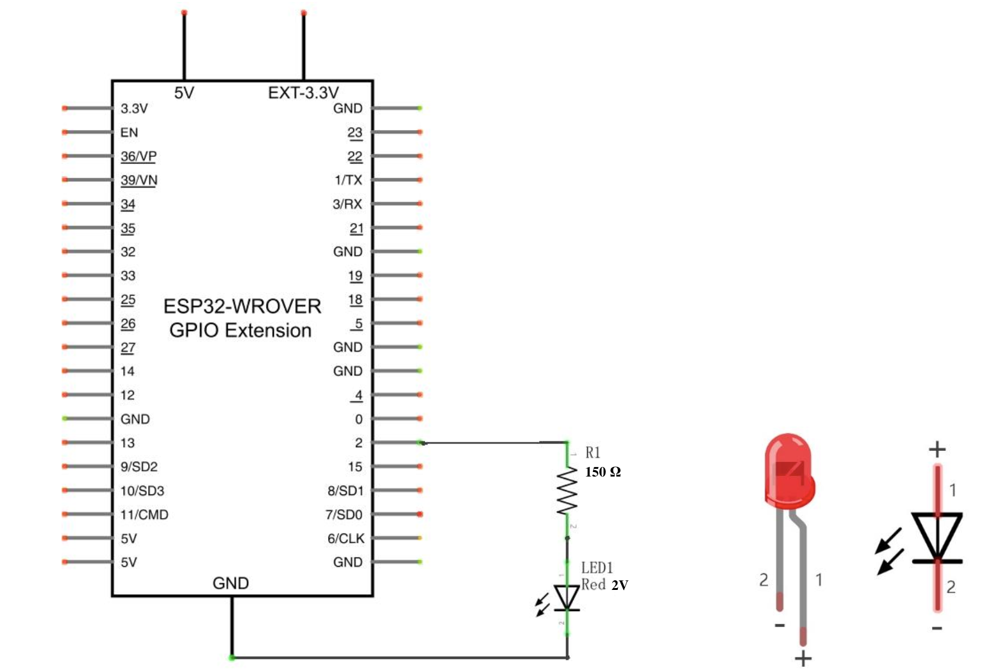
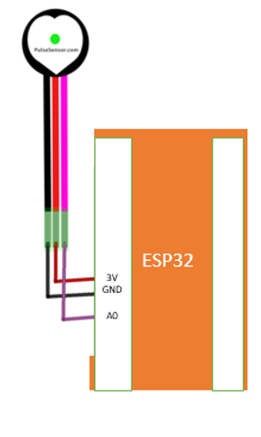
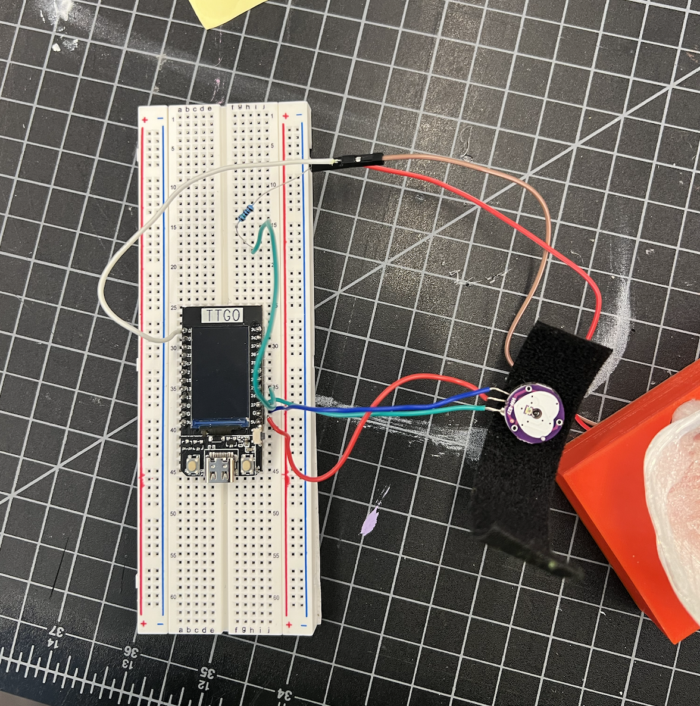
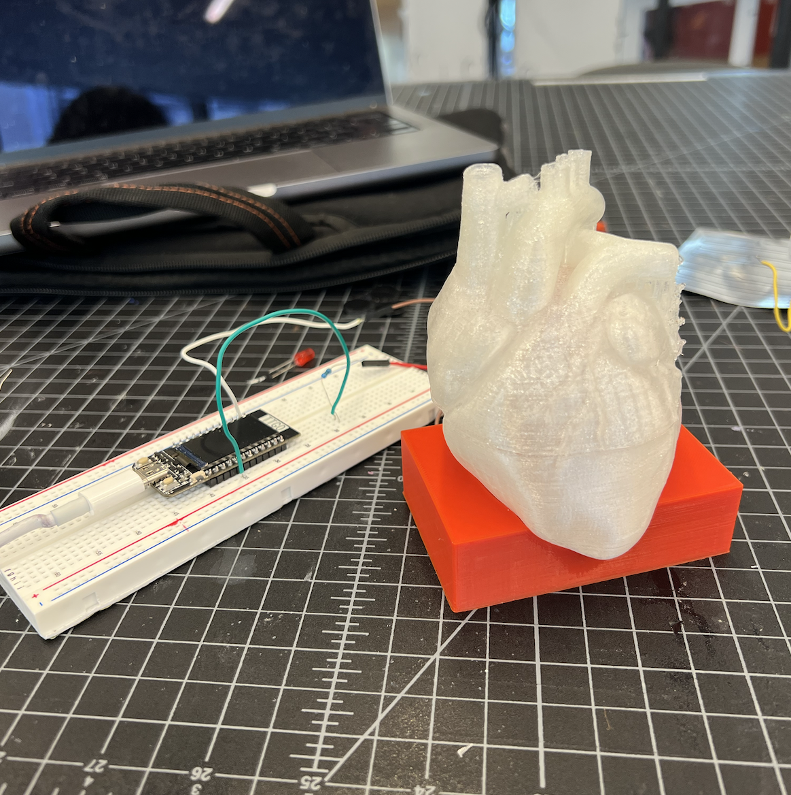

# Module 3 - Meditation to Your Beat

## Project Description
The goal of this project is to create an interactive visualization that would use a pulse sensor to read a person's heart beat and send to my laptop for generating a visual that adapts to the pulse. THe visualization 

### Artistic Vision 

After seeing a James Turrell's skyscape, I was inspired by him to create a space that encourages people to sit and observe the nature and space around them as well themsleves. To encourage people to look inward and be at peace, I was inspired by the Heart Rhythm Meditation method that coordinates our 
breath with our heartbeats to generate a powerful internal rhythm that creates heart coherence which is a state of balance with the head, heart, and body.


<div style="display: inline-block; height=300;">
    
    
</div>

Hence, I ultimately want to create an interactive space that allow us to visualize our heart beat as we meditate, to hopefully promote our inner peace without the distraction of the crazy world around us.  

## Technical Documentation

### Materials and Softwares required:
- 1 USB-C cord
- 1 ESP32 TTGO T-display
- 1 Breadboard
- 1 150ohm resistor
- 1 2v Red LED 
- 1 Pulse Sensor
- wires
- Arduino
- Touch Designer
- <a href="https://github.com/WorldFamousElectronics/PulseSensorPlayground">Pulse Sensor Playground Library</a></li>
- 3D printer
- PLA 3D filament
- UltiMaker Cura


### Files required: 
```
/module3/PulseRate.ino        
```
Setting up Serial communication with ESP32 pins
- Opens the serial port at a set baud rate for serial data transmission. 
- Reads heart beat data from the Pulse Sensor to Serial Monitor.
- Prints data to the serial port as human-readable ASCII text.
- Red LED blinks to heart beat.

```
/module3/heartEmoji.obj
```
Heart Emoji Object File for Touch Designer
- To be imported into the Touch Designer file 
- Model for the design

```
/module3/heart.toe
```
Touch Designer visualization
- Setup: import heart emoji object file, select correct port and baud rate
- Press play to see the visualization adapt to heart beat 


### Setting up the Heart Model:  

1. Set up ESP32, Pulse Sensor, resistor and Red LED on a breadboard according to the schematic diagrams below
2. Place Red LED inside the heart Model and the wires inside the platform to hide the LED and wires.
3. Place the Pulse Sensor through the finger box to hide the sensor and wires.

<div style="display: inline-block;">
        
        
        
</div>


### Running the program:  
1. Open module3/PulseRate.ino in Arduino and run it on ESP32. Make sure the baud rate is set to match the one specified in the code.
2. Open module3/heart.toe in Touch Designer
    - Import module3/heartEmoji.obj in the 'filein' box 
    - Set up correct port and baud rate in 'serial1' box 
    - Press 'Play' and view final visualization in 'Null6' box.

### Enclosure Design
<div style="display: inline-block; height=300;">
    
</div>

The design file for the heart model is found on <a href="https://www.thingiverse.com/thing:1937314">Thingiverse</a>. I printed the heart model with
translucent PLA and the bottom with Red PLA to match the Red LED that will be placed inside the heart model. 


## Final Result 

<div style="display: inline-block; height=500;">
    
    
    

</div>

## Blog Post & Video

Blog Post: https://wendysung.github.io/creative-embedded-system/module3/module3.html

Youtube: https://www.youtube.com/watch?v=I4cObmevYd8